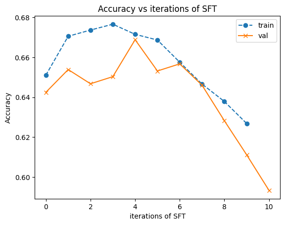
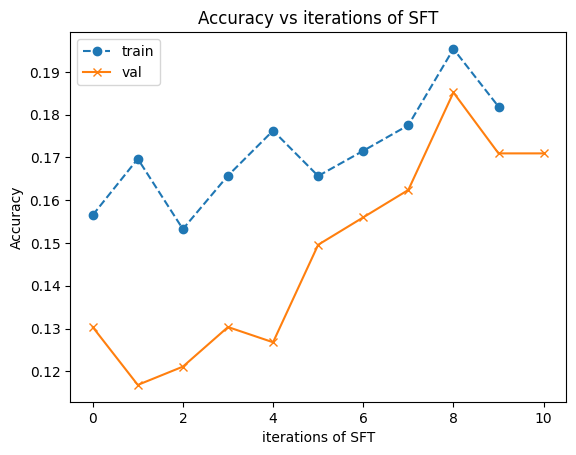

# Reasoning project for Deep Reinforcement Learning
Team with Atharva, Lorand, and Milad and Yixiong Hao, Ayush

Project Goal: to investigate the potential improvement in down stream general reasoning ability given modifications to Quiet-STaR esk training. We are tackling some problem settings which we expect to be very easy to initially improve over the naive performance, one such setting is multilingual MMLU, for which the performance degrades substantially, when asking MMLU questions in a different langauge.

Roadmap:
1. replicate STaR setting of QA for MMLU to see what signal can be gotten 

## Initial goal of Replicating STaR for multilingual MMLU

Below is an initial result on the english MMLU setting, where iterative finetuning showed only marginal improved performance of MMLU on a held out validation split. We don't expect MMLU reasoning generation on english to significantly change the performance given prior works show insignificant performance changes when using chain of thought style prompting on this simple benchmark. It is, however interesting to observe as a point of reference for non english experiments.



Below the STaR method (without rationalization) trained on Yoruba MMLU. The perforamce in this case starts below random (25 % for these four answer MCQs) due to degenerate outputs from LLama 3.1 8B instruct on the low resource langauge of Yoruba. 

Here are two example degenerate output answers:
```
Ṣeese esi lati ṣe ṣe ṣe ṣe ṣe ṣe ṣe ṣe ṣe ṣe ṣe ṣe ṣe ṣe ṣe ṣe ṣe ṣe ṣe ṣe ṣe ṣe ṣe ṣe ṣe ṣe ṣe ṣe ṣe ṣe ṣe ṣe ṣe ṣe ṣe ṣe ṣe ṣe ṣe ṣe ṣe ṣe ṣe ṣe ṣe ṣe ṣe ṣe ṣe ṣe ṣe ṣe ṣe ṣe ṣe ṣe ṣe ṣe ṣe ṣe ṣe ṣe ṣe ṣe ṣe ṣe ṣe ṣe ṣe ṣe ṣe ṣe ṣe ṣe ṣe ṣe ṣe ṣe ṣe ṣe ṣe ṣe ṣe ṣe ṣe ṣe ṣe ṣe ṣe ṣe ...

Ipa italẹ fun awọn ohun elo ti awọn asidi ọra polyunsaturated adayeba ninu awọn epo ẹfọ ni.\n\nAwọn asidi ọra polyunsaturated ni awọn asidi ọra ti o ni iwe ifowopamọ carbon-carbon meji. Awọn iwe ifowopamọ carbon-carbon meji ni awọn iwe ifowopamọ meji ti o ni awọn atomu carbon 2, 3, 4, 5, 6, 7, 8, 9, 10, 11, 12, 13, ...
```



# some scripts with hydra for convience:
<!-- python run.py trainer.single_batch=true trainer.gen_batch_size=32 -->

// for seeing if I can fit to a single batch of data.
python run.py trainer.single_batch=true trainer.gen_batch_size=8 trainer.train_batch_size=8 trainer.agent.model_handler.warmup=0

python run.py -m trainer.gen_batch_size=24 trainer.train_batch_size=16 logger=CustomWandBLogger trainer.dataset_name=mmlu_YO-NG run_type=train_translate

python run.py logger=CustomWandBLogger trainer.train_batch_size=32 trainer.gen_batch_s
ize=64 run_type=train_english trainer.dataset_name=mmlu


python run.py trainer.single_batch=true trainer.gen_batch_size=8 trainer.train_batch_size=8 trainer.agent.model_handler.warmup=0

python run.py trainer.single_batch=true trainer.gen_batch_size=8 trainer.train_batch_size=8 trainer.agent.model_handler.warmup=0 trainer.train_strategy=dpo trainer.samples_per_train_question=5

python run.py -m run_type=train_dpo_english trainer.gen_batch_size=64 trainer.train_batch_size=6 trainer.train_strategy=dpo trainer.samples_per_train_question=2 logger=CustomWandBLogger trainer.dataset_name=mmlu trainer.agent.model_handler.optimizer_partial.lr=0.0002 trainer.dpo_beta=0.1

// this script is for just generating a bunch of data, so that I can have robust training signal in the first round of DPO.
python run.py -m run_type=train_dpo_english trainer.gen_batch_size=64 trainer.train_batch_size=6 trainer.train_strategy=dpo trainer.samples_per_train_question=12 logger=CustomWandBLogger trainer.dataset_name=mmlu trainer.agent.model_handler.optimizer_partial.lr=0.0002 trainer.dpo_beta=0.1 trainer.max_epochs=1

// this script for testing different parameters on the DPO learning objective, by just doing essentially the first iteration of star.
python run.py -m run_type=train_dpo_english trainer.gen_batch_size=64 trainer.train_batch_size=6 trainer.train_strategy=dpo trainer.samples_per_train_question=2 logger=CustomWandBLogger trainer.dataset_name=mmlu trainer.agent.model_handler.optimizer_partial.lr=0.00002 trainer.dpo_beta=0.1 trainer.val_every_n_steps=60 trainer.skip_first_validation_loop=true "trainer.preload_data_for_training=/nethome/jbjorner3/dev/hallucination-fun/star/star_runs/train_dpo_english_2024-11-07/12-28-14_0/train_0/generated.csv" "trainer.preload_data_for_val=/nethome/jbjorner3/dev/hallucination-fun/star/star_runs/train_dpo_english_2024-11-13/23-30-22/val_0/generated.csv" trainer.max_epochs=1

// replicate trl success (Figured out grad norm issue!)
// the issue was that I was using the right_pad_id as a left padding. I didn't think it would really make a difference given that my label was -100 on it, and my attention mask blocked it out, but it seems this was the issue, on top of this there is some discrepancy between TRL and my impelmentation where TRL does cross entropy manually, but I rely on pytorch's C implementation. I don't know which one is more stable, or whatever, this needs to be seen.

python run.py -m run_type=train_dpo_english trainer.gen_batch_size=64 trainer.train_batch_size=6 trainer.train_strategy=dpo trainer.samples_per_train_question=2 logger=CustomWandBLogger trainer.dataset_name=mmlu trainer.agent.model_handler.optimizer_partial.lr=1e-5 trainer.dpo_beta=0.1 trainer.val_every_n_steps=60 trainer.skip_first_validation_loop=true "trainer.preload_data_for_training=/nethome/jbjorner3/dev/hallucination-fun/star/star_runs/train_dpo_english_2024-11-07/12-28-14_0/train_0/generated.csv" "trainer.preload_data_for_val=/nethome/jbjorner3/dev/hallucination-fun/star/star_runs/train_dpo_english_2024-11-13/23-30-22/val_0/generated.csv" trainer.max_epochs=1 trainer.log_every_n_steps=1 trainer.train_gradient_accumulation_steps=1 trainer.agent.model_handler.optimizer_partial.weight_decay=0.0 trainer.agent.model_handler.lora_r=64 trainer.interal_epochs=1 trainer.agent.model_handler.warmup=45

// 3x sample run (then we find right beta, batch size, lr, and weight decay by sweeping over this train and eval set, and then launch a training run for real) // I ended up creating the data from my 10x run.
python run.py -m run_type=train_dpo_english trainer.gen_batch_size=64 trainer.train_batch_size=6 trainer.train_gradient_accumulation_steps=4 trainer.train_strategy=dpo trainer.samples_per_train_question=3 logger=CustomWandBLogger trainer.dataset_name=mmlu trainer.agent.model_handler.optimizer_partial.lr=5e-6 trainer.dpo_beta=0.1 trainer.val_every_n_steps=60 trainer.skip_first_validation_loop=true trainer.max_epochs=1 trainer.log_every_n_steps=1 trainer.agent.model_handler.optimizer_partial.weight_decay=0.0 trainer.agent.model_handler.lora_r=64 trainer.interal_epochs=1 trainer.agent.model_handler.warmup=45 "trainer.preload_data_for_training=/nethome/jbjorner3/dev/hallucination-fun/star/scratch/train_3x_generated.csv" "trainer.preload_data_for_val=/nethome/jbjorner3/dev/hallucination-fun/star/scratch/val_3x_generated.csv" trainer.do_eval=false hydra.launcher.partition=overcap


// generating a bunch of data:
python run.py -m run_type=train_dpo_english trainer.gen_batch_size=64 trainer.train_batch_size=4 trainer.train_strategy=dpo trainer.samples_per_train_question=10 logger=CustomWandBLogger trainer.dataset_name=mmlu trainer.agent.model_handler.optimizer_partial.lr=5.0e-6 trainer.dpo_beta=0.1 trainer.val_every_n_steps=60 trainer.skip_first_validation_loop=false trainer.max_epochs=1 trainer.interal_epochs=0 

tried learning rate 0.00002, now trying 0.0002, maybe also try different beta. maybe also try reinforce tuning before to make the ref model and starting model supervised on the winning responses. (doing reinforce before is only actually done when the data isn't from the original model.)

<!-- python run.py run_type=val trainer.gen_batch_size=48 "trainer.dataset_name=mmlu_YO-NG" "+current_global_step=2" "+model_checkpoint_to_eval=/nethome/jbjorner3/dev/hallucination-fun/star/star_runs/train_2024-10-01/03-06-34_0/checkpoint_2"

python run.py run_type=val trainer.gen_batch_size=32 "trainer.dataset_name=mmlu_YO-NG" "+current_global_step=150" "+model_checkpoint_to_eval=/nethome/jbjorner3/dev/hallucination-fun/star/star_runs/train_2024-10-01/03-06-34_0/checkpoint_2" -->

# section on DPO policy improvement MATH to formalize questions.

Max Entropy RL in the General Case:
$$\pi^* = \argmax_{\pi}\mathop{\mathbb{E}}_{x \sim \mathcal{D} \hspace{3px} z \sim \pi(z | x)}[Q^\pi(z, x)] - \lambda \text{KL}[\pi(z | x) || \pi_{ref}(z | x)]$$

It is important to note that the general case is analyzed in other papers like Advantage weighted actor critic, where they seek policy improvement in the support of the data explored by some reference policy. The advantage is typically of some old policy and you update it with what is done in the IQL paper. 

Max Entropy RL objective in the contextual bandit case for DPO: 

(we can ignore certain complexities which occur in the general case.)

$$\pi^* = \argmax_{\pi}\mathop{\mathbb{E}}_{x \sim \mathcal{D} \hspace{3px} z \sim \pi(z | x)}[r(z, x)] - \lambda \text{KL}[\pi(z | x) || \pi_{ref}(z | x)]$$

$$\pi^* = \argmax_{\pi}\mathop{\mathbb{E}}_{x \sim \mathcal{D}}[\pi(z | x) (r(z, x) - \lambda \log({\frac{\pi(z | x)}{\pi_{ref}(z | x)}}))] $$

$$\pi^* = \argmax_{\pi}\mathop{\mathbb{E}}_{x \sim \mathcal{D}}[\pi(z | x) (\lambda\log(\exp(\frac{1}{\lambda}r(z, x))) - \lambda \log({\frac{\pi(z | x)}{\pi_{ref}(z | x)}}))] $$

$$\pi^* = \lambda \argmax_{\pi}\mathop{\mathbb{E}}_{x \sim \mathcal{D}}[\pi(z | x) (-  \log({\frac{\pi(z | x)}{\pi_{ref}(z | x) \exp(\frac{1}{\lambda}r(z, x))}}))] $$

$$\pi^* =  \lambda \argmin_{\pi}\mathop{\mathbb{E}}_{x \sim \mathcal{D}}[\pi(z | x)  \log({\frac{\pi(z | x)}{\pi_{ref}(z | x) \exp(\frac{1}{\lambda}r(z, x))}})] $$

$$\pi^*(z | x) \propto  \pi_{ref}(z | x) \exp(\frac{1}{\lambda}r(z, x))$$

$$\pi^*(z | x) = \frac{1}{Z(x)} \pi_{ref}(z | x) \exp(\frac{1}{\lambda}r(z, x))$$

Max Entropy RL objective with contextual bandits but for quiet star case.

we might assume our reward is $r(x, z, y) = \log p(y | x, z)$, but in the case of Aleotoric uncertainty (ie there are actually multiple valid next continuations), we would find the optimal for this objective by a rational generator which would simply give the distribution over y's (ie a language model would solve our rational problem, but that isn't what we want to happen.).

imagine we have a question: "What is the best letter A, B, C or D?", and we assign uniform probability to each answer, given these examples, and the reward $r(x, z, y) = \log p(y | x, z)$,  our model would achieve high reward for the rational "the answer is X" when the answer is in fact X, even though this was by chance. The answer $z^*$="There is uncertainty about the answer. It could be A B C or D" is only incentivized when by chance. Assuming we sampled all 5 possible rational and then performed matching via cross entropy with  the target under dpo $ \frac{\exp(r(x, y, z))}{\sum_{z_i}{\exp(r(x, y, z_i))}}$ we would have the answer which was marked correct recieve a weight of 1 / (1 + 0.25) and the uncertain rational recieve 0.25 / (1 + 0.25). if we repeat this for every possible outcome and our cross entropy term is an MLE result saying that the probabilities would be 1 / 5 for all rational. This is instead of 100% for what we might consider to be the correct rational, which expresses uncertainty.

$\frac{0.25}{1.25} \log(\frac{P(z=z^*|x)}{P(z=A | x) + P(z=B | x) + P(z=C | x) + P(z=D | x)}) + \frac{1}{1.25} \log(\frac{P(z=A|x)}{P(z=z^* | x) + P(z=B | x) + P(z=C | x) + P(z=D | x)})$

$+\frac{0.25}{1.25} \log(\frac{P(z=z^*|x)}{P(z=A | x) + P(z=B | x) + P(z=C | x) + P(z=D | x)}) + \frac{1}{1.25} \log(\frac{P(z=B|x)}{P(z=A | x) + P(z=z^* | x) + P(z=C | x) + P(z=D | x)})$

$+\frac{0.25}{1.25} \log(\frac{P(z=z^*|x)}{P(z=A | x) + P(z=B | x) + P(z=C | x) + P(z=D | x)}) + \frac{1}{1.25} \log(\frac{P(z=C|x)}{P(z=A | x) + P(z=B | x) + P(z=z^* | x) + P(z=D | x)})$

$+\frac{0.25}{1.25} \log(\frac{P(z=z^*|x)}{P(z=A | x) + P(z=B | x) + P(z=C | x) + P(z=D | x)}) + \frac{1}{1.25} \log(\frac{P(z=D|x)}{P(z=A | x) + P(z=z^* | x) + P(z=C | x) + P(z=z^* | x)})$

=

$\frac{1}{5} \log(\frac{P(z=z^*|x)}{P(z=A | x) + P(z=B | x) + P(z=C | x) + P(z=D | x)})$

$+ \frac{1}{5} \log(\frac{P(z=A|x)}{P(z=z^* | x) + P(z=B | x) + P(z=C | x) + P(z=D | x)})$

$+ \frac{1}{5} \log(\frac{P(z=B|x)}{P(z=A | x) + P(z=z^* | x) + P(z=C | x) + P(z=D | x)})$

$+ \frac{1}{5} \log(\frac{P(z=C|x)}{P(z=A | x) + P(z=B | x) + P(z=z^* | x) + P(z=D | x)})$

$+ \frac{1}{5} \log(\frac{P(z=D|x)}{P(z=A | x) + P(z=B | x) + P(z=C | x) + P(z=z^* | x)})$

We might say that this makes sense as the expected reward per rational is the same, so all strategies can be equally encouraged, but what is alarming is that "the answer is X" imparts the same distribution over rationals as our P imparts over answers, which makes our rational look a lot like the language model we are using as our reward model this is if our language model models the answer well. If it doesn't model the answer well, then our rational needs to be better than the language model... for tokens with low likelihoods we could expect that additional computation might increase their modeling ability, and if they are deterministic, like for math equations, the distribution of language problem is solved.

mutual information of the answer given the rational and the question and the answer given just the question $\mathcal{I}[q(z | x) ; q(y | x)] = 0$

$$\mathcal{I}[q(z | x) ; q(y | x)] = \text{KL}[q(y, z | x) || q(z | x) q(y | x)]$$

$$= \sum_{y, z \in \mathcal{Y} \times \mathcal{Z} }q(y, z | x)\log(\frac{q(y, z | x)}{q(z | x) q(y | x)})$$

$$= \sum_{y, z \in \mathcal{Y} \times \mathcal{Z} }q(y | z,  x)q(z |  x)\log(\frac{q(y| z, x)q(z | x)}{q(z | x) q(y | x)})$$
<!-- make an assumption that $q(z | x) \not= 0$ for all $z \in \mathcal{Z}$  ??? I don't think this assumption has to be made.-->
$$= \sum_{y, z \in \mathcal{Y} \times \mathcal{Z} }q(y | z,  x)q(z |  x)\log(\frac{q(y| z, x)}{q(y | x)})$$

$$= \mathcal{H}[q(y | x)] - \mathcal{H}[q(y | z, x)]$$

but the true proability doesn't change no matter what the rational is.

we can look at the expected reduction of entropy in correct answer encoding across random true answers (note this is not mutual information):

$$= \mathop{\mathbb{E}}_{y_{true} \in \{A,B,C,D\}}[\mathcal{H}[p(y=y_{true} | x)] - \mathcal{H}[p(y=y_{true} | z, x)]]$$

$$= \mathop{\mathbb{E}}_{y_{true} \in \{A,B,C,D\}}[2 - \frac{1}{5}(\log(\frac{1}{p(y=y_{true} | z=z^*, x)}) + \sum_{z_i \in \{A,B,C,D\}}\log(\frac{1}{p(y=y_{true} | z = z_i, x)} ))]$$

$$= \mathop{\mathbb{E}}_{y_{true} \in \{A,B,C,D\}}[2 - \frac{1}{5}(\log(\frac{4}{1}) + \log(\frac{1}{1}) + \log(\frac{1}{0}) + \log(\frac{1}{0}) + \log(\frac{1}{0}))]$$

$$= \mathop{\mathbb{E}}_{y_{true} \in \{A,B,C,D\}}[2 - \frac{1}{5}(2 + 0 + \infin + \infin + \infin)]$$

$$=-\infin$$

The best model p would have to ignore the rational to achieve the correct distirbution over answers in this inherently stochastic environment. 

if we instead use the following reward, our rational would be useful in improving the likelihood in the expectation above.

$$r(x, z) = \log({\mathop{\mathbb{E}}_{y \sim \mathcal{D}(y | x)}[p(y | x, z)]})$$

we however don't have access to the distribution over answers given some x. and we can't learn it any better than we already are (kind of a priveleged metric idea.)

we want the rational we produce to help model the distribution over next tokens better not just on average, but every time we sample a rational, and if we expect the rational won't help us improve our likelihood on the next tokens we shouldn't sample a rational.

if we don't want our rational to capture properties about the distribution over next tokens which is already captured in the p(y | x) model to begin with, it would make sense to ignore all rationals for this question as none of them reduce the expected incoding over next true tokens. (the A, B, C, D rational make the expected encoding infinite, and the $z^*$ simply doesn't hurt)


# Questions about Quiet-STaR objective

quiet-star's reward question. (I think quiet-star's variance reduction baseline isn't valid.... I have taken some time, and now think that quiet-STaR's objective is fine. I need to look into what DPO is doing and if using point estimates of reward objective is reasonable, or if you should learn a reward model and then fit to this reward model over your data?)

$$r_j = \log(p^{talk}_{j:j+n_{true}}(X_{j+1:j+n_{true+1}})) - \log(\bar p^{talk}_{j:j+n_{true}}(X_{j+1:j+n_{true+1}}))$$

Where the second term is noted to be a variance reduction term in the paper. 
